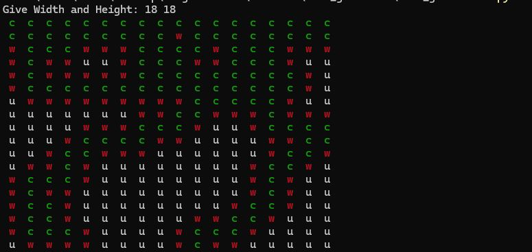
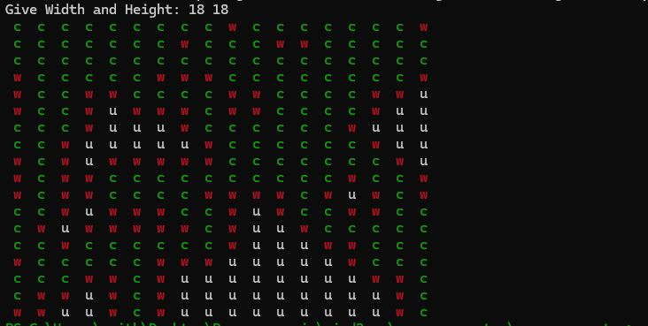
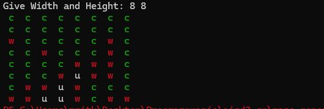

# Algorithms and Data Structures II
Algorytmy I struktury danych II

1) Set Implementation 
2) Priority Queue Implementation

## Maze Generator - Project I
Generating maze with BFS Algorithm, There is Alwayes only 1 possbile exit cell

Struktury danych 30pkt
kolokwia 40pkt
zadania do oddania 30pkt
