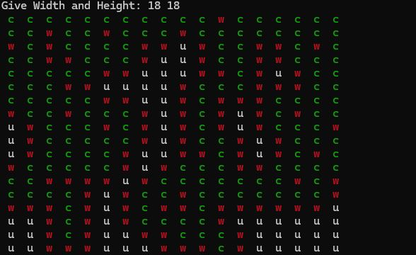
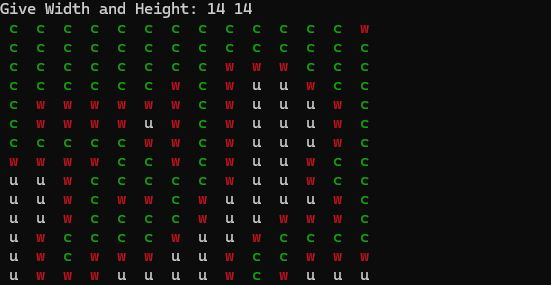

# Algorithms and Data Structures II
Algorytmy I struktury danych II

1) Set Implementation 
2) Priority Queue Implementation

## Maze Generator - Project I
TODO:
* wykonać parametr - `Gęstosc` labiryntu tak aby uzytkownik mógł decydowac o zageszczeniu labiryntu 

Generating maze with BFS Algorithm, There is Alwayes only 1 possbile exit cell

`python3 generator.py`

Struktury danych 30pkt
kolokwia 40pkt
zadania do oddania 30pkt
